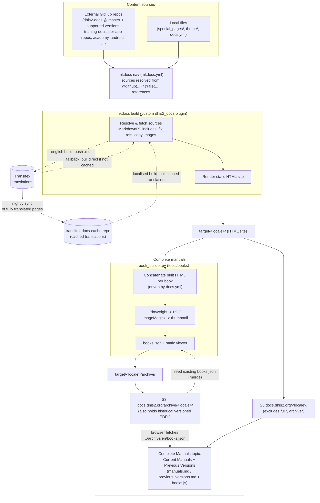

# Documentation data flow

A high-level overview of how content moves through this builder, from sources to
the published site and PDF books. It focuses on the **English with books**
workflow ([`.github/workflows/english_with_books.yml`](.github/workflows/english_with_books.yml)),
with notes on how localised builds differ.

> **Note**
> Here "Books" is simply a reference to complete (PDF) versions of entire sections of the documentation. These are available for `master` versions and are the preferred way to maintain archives of old versions (we have moved away from maintaining all of the html content for deprecated versions.)

## Gathering sources and building the docs

### Stages

1. **Sources.** Page content is not stored in this repo — the mkdocs nav references it
   with `@github(repo, path, branch)` (external repos such as `dhis2/dhis2-docs`,
   `training-docs`, `academy-*`) and `@file(path)` (local pages under `special_pages/`).
   The `dhis2_docs` mkdocs plugin expands the nav and fetches each source.
2. **Translation (Transifex).** On an English build the plugin *pushes* the English
   source files to Transifex as resources. (Localised builds *pull* instead — see below.)
3. **mkdocs build.** Sources are preprocessed (MarkdownPP includes, reference/anchor
   fixing, image copying) and rendered to a static HTML site in `target/en/`.
4. **Deploy site.** The site syncs to S3 under `en/`, excluding the `full*`
   (single-page) and `archive*` trees.
5. **Build books.** Before building, the workflow seeds the locally-built `archive/` tree
   with the currently-published `books.json` so the catalogue is *merged*, not replaced.
   `book_builder.py` then reads `docs.yml` (categories + book definitions), concatenates
   the already-built HTML for each book, prints it to PDF with Playwright, generates a
   cover thumbnail with ImageMagick, and updates the manifest plus the static viewer.
   A book may declare an optional `version:`; versioned books are written to a
   `archive/en/<version>/` subfolder so they never overwrite the latest (unversioned) build.
6. **Deploy books.** The `archive/` tree syncs to S3 under `archive/en/` — a **sibling** of
   the `en/` site tree, so per-language site syncs (which use `--delete`) can never clobber
   the catalogue. The sync runs without `--delete`, so older versioned PDFs persist. The
   same `archive/<lang>/` root also holds the historical (pre-tool) versioned manuals,
   catalogued in the seeded `books.json`.
7. **Runtime.** Under the **Complete Manuals** nav topic, two pages load `books.js`,
   which fetches `../archive/<lang>/books.json` relative to the script and renders category
   shelves (labels, colours and order come from the manifest, originally configured in
   `docs.yml`):
   - **Current Manuals** (`manuals.md`) shows the latest, *unversioned* books.
   - **Previous Versions** (`previous_versions.md`) shows *versioned* books one version at
     a time, chosen from a selector at the top (defaults to the newest).

> The PDFs are generated *from* the freshly built HTML site, so the book build always
> runs after the site build. The same pattern applies per language: each build deploys
> its site to `<lang>/` and its books to the shared `archive/<lang>/`.

### Where the content comes from

Almost no page content lives in this repo — it is federated across many GitHub
repositories and pulled at build time at the **branch or version pinned in each nav
reference** (`@github(repo, path, ref)`). The main sources:

| Source | Ref(s) | Provides |
| --- | --- | --- |
| `dhis2/dhis2-docs` | `master`, currently supported version branches (e.g. `2.43`) | Core platform docs (use / implement / develop / manage). Version branches let the site carry version-specific docs side by side. |
| `dhis2/training-docs` | `main` | Training material and academy general guidance. |
| Per-app repos (see full list below) | default branch | Each web app's user manual, sourced from the app's own repository. |
| `hisptz/unicef-apps-docs` | `master`, tagged (e.g. `scorecard-v2.5.0`) | Optional / UNICEF app manuals (scorecard, bottleneck analysis, …). |
| `dhis2/academy-dhis2-fundamentals` | `master` | Academy course textbooks. |
| `dhis2/dhis2-android-docs`, `dhis2/dhis2-android-sdk` | `main` / `master` | Android app and SDK documentation. |
| Others — `dhis2/dhis2-docs-implementation`, `dhis2/metadata-package-development`, `dhis2/dhis2-releases`, `dhis2designlab/project-toolkit`, `pamod-dev/dhis2-doc-support` | various | Implementation guides, metadata packages, release notes and supporting material. |

The per-app repositories whose manuals are pulled in are: `dashboard-app`,
`data-visualizer-app`, `maps-app`, `line-listing-app`, `capture-app`, `approval-app`,
`aggregate-data-entry-app`, `app-management-app`, `user-profile-app`,
`usage-analytics-app`, `route-manager-app` and `cache-cleaner-app`.

Local sources (kept in **this** repo) are referenced with `@file(...)` or read directly:

- `special_pages/` — pages authored here, including the Complete Manuals page and the
  403/404 pages.
- `docs.yml` — the book definitions (which books exist, their categories, order and
  colours) consumed by `book_builder.py`.
- `theme/` — the site theme, styles and scripts (including `books.js` / `books.css`).

## Localised builds

Localised builds ([`localised_with_books.yml`](.github/workflows/localised_with_books.yml)) follow the same
two-step pattern — build the site, then build the books — per locale, with these
differences from English:

- **Language is set** via `DHIS2_DOCS_LANGUAGE` (e.g. `fr`, `es_419`, `pt`, `cs`,
  `zh`, `ar`). The plugin *pulls* translated versions of each resource from Transifex
  (through the `transifex-docs-cache` repo) instead of pushing.
- **Output and deploy are per-locale:** the site syncs to S3 under `<locale>/` and the
  books to the shared `archive/<locale>/`.
- **Books are built from the localised HTML**, so each locale gets its own PDFs and its
  own `books.json`. The Current Manuals and Previous Versions pages work the same on
  every site: `books.js` fetches `../archive/<locale>/books.json` relative to itself, so it
  resolves the right manifest per language with no per-locale configuration.
